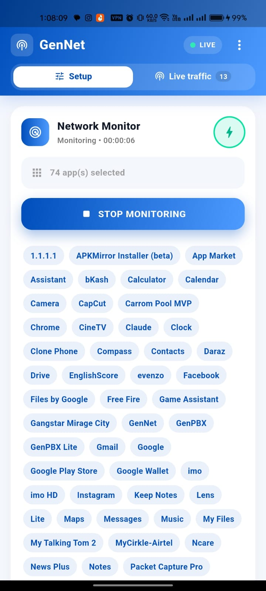
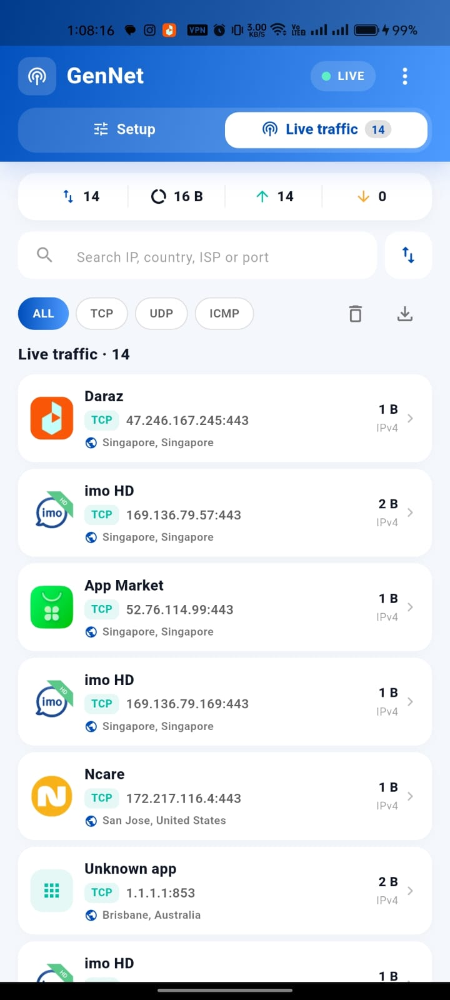

# AppTrack

AppTrack is a Flutter-based Android network traffic monitoring application.

It uses Android's `VpnService` to observe network traffic locally and presents live connection information in a simple, user-friendly interface.

## Features

- 📡 Live network traffic monitoring
- 🔎 Search traffic by IP, country, ISP, or port
- 🌐 Display destination IP addresses and ports
- 📱 Show the application associated with network traffic
- 🌍 Display IP geolocation information
- 🔄 Live traffic statistics
- 🧹 Clear live traffic entries
- 📤 Export traffic information
- 🧩 TCP, UDP, and ICMP traffic filters
- ⚙️ Setup and monitoring controls
- 🎨 Clean Flutter UI with Android native integration

## Screenshots

### App UI



### Live Traffic



## Tech Stack

- Flutter
- Dart
- Kotlin
- Android `VpnService`
- Native Android integration
- MethodChannel / platform integration

## Project Structure

```text
lib/
├── app.dart
├── main.dart
├── models/
├── pages/
└── services/

android/
├── app/
└── ...

assets/
├── hev_config.yml
└── ...

hev-socks5-server/
└── ...

UI/
├── apptrack_ui.png
└── live_traffic.png
```

## Getting Started

### 1. Clone the repository

```bash
git clone https://github.com/fsdramjan/AppTrack_FLOW_FIXED_FULL.git
cd AppTrack_FLOW_FIXED_FULL
```

### 2. Install dependencies

```bash
flutter pub get
```

### 3. Run the application

Connect an Android device or start an Android emulator, then run:

```bash
flutter run
```

## Android Requirements

The application requires Android VPN functionality through `android.net.VpnService`.

When monitoring starts, Android may display a VPN permission/system confirmation dialog. This is expected behavior for applications using `VpnService`.

## Notes

- This project is intended for network traffic monitoring on the user's own device.
- Some functionality depends on Android platform permissions and native components.
- Do not commit API keys, credentials, `.env` files, generated build files, or other sensitive information.

## License

Add your preferred license here.
